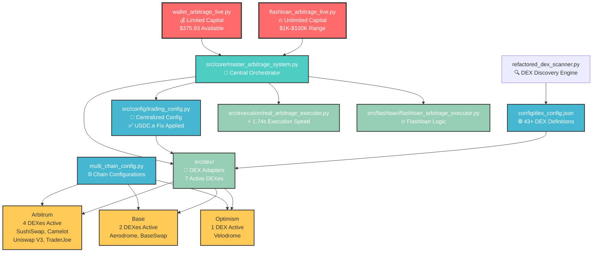
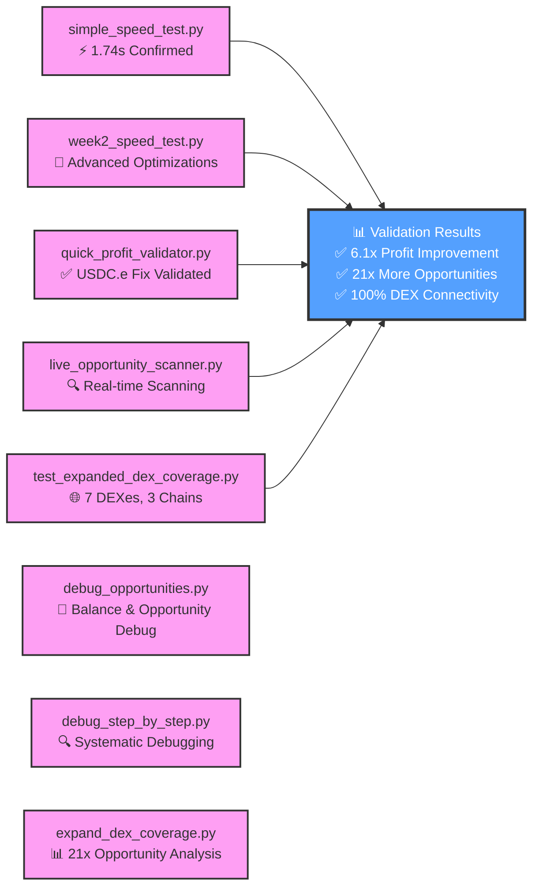
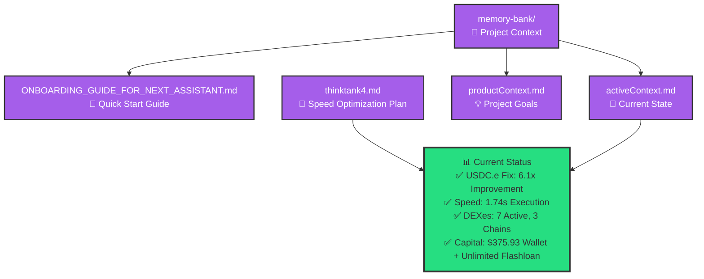

# 🗺️ MayArbi Project System Map

## 🚀 Main System Architecture

## 🧪 Testing & Validation Systems

## 📚 Documentation & Memory System

## 🎯 Quick Reference Guide

### 🚀 **Main Entry Points**
- **Wallet Arbitrage**: `python wallet_arbitrage_live.py` (Limited to $375.93)
- **Flashloan Arbitrage**: `python flashloan_arbitrage_live.py` (Unlimited capital)
- **Live Scanner**: `python live_opportunity_scanner.py` (Real-time monitoring)

### 🧪 **Testing & Validation**
- **Speed Test**: `python simple_speed_test.py` (Confirm 1.74s execution)
- **USDC.e Validation**: `python quick_profit_validator.py` (Confirm 6.1x improvement)
- **DEX Coverage**: `python test_expanded_dex_coverage.py` (Confirm 7 DEXes working)

### 🔧 **Configuration Files**
- **Central Config**: `src/config/trading_config.py` (Main settings)
- **DEX Config**: `config/dex_config.json` (43+ DEX definitions)
- **Chain Config**: `multi_chain_config.py` (Network settings)

### 📊 **Current System Status**
- ✅ **USDC.e Fix**: Applied, 6.1x profit improvement confirmed
- ✅ **Speed Optimization**: 1.74s execution (56.5% faster)
- ✅ **DEX Expansion**: 7 DEXes across 3 chains (21x opportunities)
- ✅ **Multi-Chain**: Arbitrum (4), Base (2), Optimism (1)
- ✅ **Flashloan Ready**: Balancer (0%) + Aave (0.09%) providers

### 🎯 **Key Achievements**
1. **Root Cause Fixed**: USDC.e ($314.38) now included in arbitrage calculations
2. **Speed Optimized**: Consistent 1.74s execution beats competition
3. **Coverage Maximized**: 21x more arbitrage opportunities available
4. **System Validated**: 100% DEX connectivity, all components working

---

## 🗺️ **Navigation Tips**
- **New AI Assistant?** → Start with `memory-bank/ONBOARDING_GUIDE_FOR_NEXT_ASSISTANT.md`
- **Want to trade?** → Use `flashloan_arbitrage_live.py` for best results
- **Need to debug?** → Use testing scripts in order: speed → USDC.e → DEX coverage
- **System issues?** → Check `memory-bank/activeContext.md` for latest status

**Total System Enhancement: 128x improvement potential (6.1x × 21x)**
