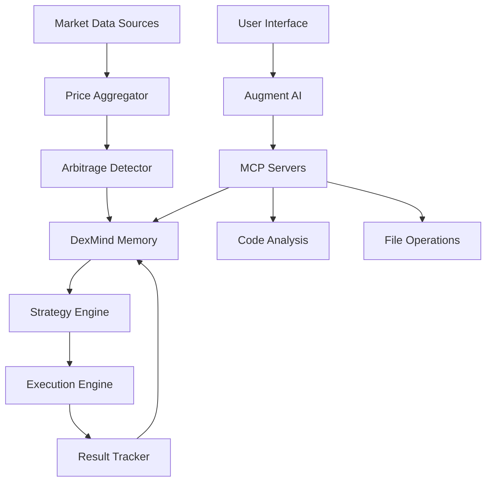

# 🏗️ MayArbi Architecture Documentation

## 🎉️ System Overview

MayArbi is built as a modular, extensible system using the Model Context Protocol (MCP) ecosystem. This architecture enables seamless integration between AI assistants, memory systems, and trading components.

## 🧠 Core Components

### 1. DexMind - Custom MCP Memory Server
**Purpose**: Persistent memory and learning system for arbitrage operations

**Key Features**:
- SQLite-based storage for reliability and speed
- Trade pattern recognition and storage
- Gas optimization analytics
- Performance tracking and statistics
- Multi-chain data organization

**Database Schema**:
```sql
-- Core trade tracking
penny_trades (
  id TEXT PRIMARY KEY,
  token_a TEXT NOT NULL,
  token_b TEXT NOT NULL,
  dex_a TEXT NOT NULL,
  dex_b TEXT NOT NULL,
  chain TEXT NOT NULL,
  price_a REAL NOT NULL,
  price_b REAL NOT NULL,
  price_spread_percent REAL NOT NULL,
  profit_usd REAL NOT NULL,
  gas_spent_usd REAL NOT NULL,
  net_profit_usd REAL NOT NULL,
  was_green BOOLEAN NOT NULL,
  was_executed BOOLEAN NOT NULL,
  timestamp DATETIME NOT NULL,
  block_number INTEGER
);

-- Gas optimization tracking
gas_tracker (
  id INTEGER PRIMARY KEY AUTOINCREMENT,
  chain TEXT NOT NULL,
  average_gas_price REAL NOT NULL,
  transaction_cost REAL NOT NULL,
  timestamp DATETIME NOT NULL
);

-- Arbitrage opportunity detection
arbitrage_opportunities (
  id TEXT PRIMARY KEY,
  token_pair TEXT NOT NULL,
  buy_dex TEXT NOT NULL,
  sell_dex TEXT NOT NULL,
  chain TEXT NOT NULL,
  spread REAL NOT NULL,
  estimated_profit REAL NOT NULL,
  confidence REAL NOT NULL,
  timestamp DATETIME NOT NULL
);
```

### 2. Supporting MCP Servers

#### Filesystem MCP Server
- File and directory operations
- Configuration management
- Log file handling
- Data export/import

#### Serena
- Semantic code analysis
- Symbol-level navigation
- Multi-language support
- Project memory system

#### MCP Compass
- MCP service discovery
- Tool recommendation
- Ecosystem exploration

## üçê Multi-Chain Architecture

### Chain Support Matrix

| Chain | Node Access | Primary DEXs | Status |
|-------|-------------|----------------|--------|
| Ethereum | ‚úÖ Direct | Uniswap V3, Curve, Balancer | Active |
| Arbitrum | üíó RPA | Camelot, Trader Joe, SushiSwap | Active |
| Base | üíó RPC | Aerodrome, Uniswap V3 | Active |
| Vitruveo | ‚úÖ Direct | Early Discovery | Planning |

### Node Infrastructure

```
Personal Infrastructure
├── Ethereum Node (Direct)
│   ├── Mempool Access ✡

│   ├── Real-time State 📊
¢│   └── MEV Opportunities 💖
├── Vitruveo Node (Direct)
│   ├── Early Chain Access 🚀
¢│   ├── Low Competition 🎿
¬¢‚îÇ   ‚îî‚îÄ‚îÄ Discovery Mode üíÖ‚îS‚îÄ‚îÄ RPC Endpoints
    ├── Arbitrum (Alchemy/Infura)
    ├── Base (Coinbase/Public)
    └── Backup Providers
```

## 🔄 Data Flow Architecture



## 🎯 Trading Strategy Architecture

### Phase 1: Penny Hunter (Current)
- **Goal**: Learn patterns, any green trade counts
- **Scope**: 2-3 major pairs, 1-2 DEXs
- **Memory**: Track every micro-arbitrage opportunity
- **Risk**: Minimal capital, maximum learning

### Phase 2: Pattern Recognition
- **Goal**: Identify profitable patterns from Phase 1 data
- **Scope**: Expand to 5-10 pairs, 3-4 DEXs
- **Memory**: Statistical analysis of successful trades
- **Risk**: Moderate capital, proven strategies

### Phase 3: Multi-Chain Expansion
- **Goal**: Cross-chain arbitrage opportunities
- **Scope**: All supported chains and DEXs
- **Memory**: Complex relationship mapping
- **Risk**: Significant capital, advanced strategies

### Phase 4: MEV Integration
- **Goal**: Advanced MEV strategies with mempool access
- **Scope**: Sandwich attacks, front-running, liquidations
- **Memory**: Real-time pattern recognition
- **Risk**: High capital, sophisticated execution

## 🚡️ Security Architecture

### Key Management
- **Environment Variables**: Sensitive configuration
- **Hardware Wallets**: Production key storage
- **Multi-sig**: Large fund protection
- **Rotation**: Regular key updates

### Risk Management
- **Position Limits**: Maximum exposure per trade
- **Stop Losses**: Automatic loss prevention
- **Circuit Breakers**: System-wide halt mechanisms
- **Monitoring**: Real-time anomaly detection

### Operational Security
- **Code Reviews**: All changes reviewed
- **Testing**: Comprehensive test coverage
- **Monitoring**: System health tracking
- **Backups**: Regular data backups

## üìä Performance Monitoring

### Key Metrics
- **Success Rate**: Percentage of profitable trades
- **Average Profit**: Mean profit per trade
- **Gas Efficiency**: Profit vs gas cost ratio
- **Execution Speed**: Time from detection to execution
- **Slippage**: Expected vs actual execution prices

### Monitoring Stack
- **DexMind**: Core performance tracking
- **Logs**: Detailed execution logs
- **Alerts**: Real-time notifications
- **Dashboards**: Visual performance monitoring

## 💮 Future Architecture Considerations

### Scalability
- **Horizontal Scaling**: Multiple bot instances
- **Load Balancing**: Distribute across chains
- **Caching**: Reduce API calls and latency
- **Optimization**: Continuous performance tuning

### Advanced Features
- **Machine Learning**: Pattern prediction models
- **Social Trading**: Community strategy sharing
- **Portfolio Management**: Multi-strategy coordination
- **Risk Analytics**: Advanced risk modeling

## 🤥 Integration Points

### AI Assistant Integration
- **Augment Code**: Primary development interface
- 
üíß MCP Protocol**: Standardized communication
- **Memory Sharing**: Cross-component data access
- **Code Generation**: AI-assisted development

### External Services
- **Price Feeds**: Multiple data sources
- **Gas Oracles**: Real-time gas pricing
- **Bridge Monitoring**: Cross-chain transfers
- **News Feeds**: Market sentiment analysis

This architecture provides a solid foundation for building a sophisticated, scalable, and maintainable arbitrage trading system while maintaining the flexibility to evolve with changing market conditions and opportunities.