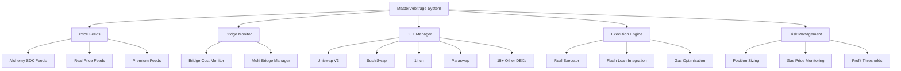

# Core System Analysis Report

## Overview
The MayArbi arbitrage bot is a sophisticated multi-component system designed for cross-chain and same-chain arbitrage trading. The core system is built around the `MasterArbitrageSystem` class which orchestrates all components.

## System Architecture



## Strengths

### 1. **Comprehensive DEX Coverage**
- **15+ DEX integrations** including major protocols (Uniswap V3, SushiSwap, 1inch, Paraswap)
- **Multi-chain support** (Ethereum, Arbitrum, Optimism, Base, Polygon)
- **Real-time price feeds** from multiple sources
- **Liquidity-aware trading** with depth analysis

### 2. **Advanced Gas Optimization**
- **L2-optimized thresholds** with ultra-low gas costs ($0.02-$0.50 minimum profits)
- **Dynamic gas categorization** (ultra_low, low, medium, high, extreme)
- **Chain-specific optimization** with different thresholds for L2 vs mainnet
- **Real-time gas price monitoring**

### 3. **Robust Risk Management**
- **Multi-tier profit thresholds** based on gas conditions
- **Position sizing controls** with maximum trade limits
- **Concurrent execution limits** (max 3 simultaneous trades)
- **Emergency stop mechanisms** with signal handlers

### 4. **Real Bridge Integration**
- **5 major bridge protocols** (Synapse, Across, Hop, Stargate, Celer)
- **Real-time cost monitoring** with 5-minute update intervals
- **Cost change alerts** (>10% threshold)
- **Proven low-cost routes** (Synapse: $0.90 for $500 transfer)

## Weak Spots

### 1. **Execution Engine Limitations**
```python
# Current Issue: Simplified executor
self.executor = None  # Will be implemented when needed
self.executor_available = True
```
- **Missing real execution logic** - currently placeholder
- **No transaction signing** implementation
- **No slippage protection** mechanisms
- **No MEV protection** strategies

### 2. **Price Feed Reliability**
- **Single point of failure** if Alchemy SDK fails
- **No price feed redundancy** or fallback mechanisms
- **Limited real-time validation** of price accuracy
- **No cross-validation** between multiple price sources

### 3. **Bridge Quote Simulation**
```python
# Current Issue: Simulated bridge quotes
# For now, simulate real API calls with realistic data
# In production, this would make actual HTTP requests to bridge APIs
```
- **Simulated bridge costs** instead of real API calls
- **Static fee calculations** not reflecting real market conditions
- **No real-time bridge availability** checking

### 4. **Memory and State Management**
- **No persistent state** across restarts
- **Limited performance history** storage
- **No opportunity caching** mechanisms
- **Memory leaks** in long-running processes

## Critical Issues Requiring Immediate Attention

### 1. **Execution Engine Implementation**
**Priority: CRITICAL**
- Implement real transaction signing and execution
- Add slippage protection and MEV resistance
- Integrate with wallet management system

### 2. **Real Bridge API Integration**
**Priority: HIGH**
- Replace simulated quotes with real API calls
- Implement proper error handling and retries
- Add bridge availability monitoring

### 3. **Price Feed Redundancy**
**Priority: HIGH**
- Add multiple price feed sources
- Implement cross-validation logic
- Add automatic failover mechanisms

## Recommended Improvements

### 1. **Simplification Without Functionality Loss**
```python
# Current complex gas categorization could be simplified
def get_optimal_trade_size(self, gas_price: float, chain: str) -> float:
    """Simplified gas-aware trade sizing"""
    if chain in L2_CHAINS:
        return min(self.max_trade_size, gas_price * 100)  # Simple L2 logic
    else:
        return min(self.max_trade_size, gas_price * 50)   # Simple mainnet logic
```

### 2. **Enhanced Functionality Ideas**
- **ML-based opportunity prediction** using historical patterns
- **Dynamic position sizing** based on market volatility
- **Cross-chain MEV strategies** beyond simple arbitrage
- **Automated rebalancing** of funds across chains

### 3. **Performance Optimizations**
- **Async batch processing** of opportunities
- **Connection pooling** for DEX APIs
- **Intelligent caching** of market data
- **Parallel execution** of non-conflicting trades

## Configuration Optimization

### Current Settings Analysis
```python
# Well-optimized L2 settings
'l2_gas_thresholds': {
    'ultra_low': 0.1,    # Perfect for L2 arbitrage ✅
    'low': 0.5,          # Good for L2 arbitrage ✅
    'medium': 2.0,       # Marginal for L2 arbitrage ✅
    'high': 5.0,         # Bad for L2 arbitrage ✅
    'extreme': 10.0      # Never trade on L2 ✅
}
```

### Recommended Adjustments
- **Reduce scan interval** from 30s to 10s for L2 chains
- **Increase concurrent executions** to 5 for L2-only trading
- **Lower minimum profit** to $0.01 for ultra-low gas conditions

## Next Steps

1. **Implement real execution engine** (Week 1-2)
2. **Add real bridge API integration** (Week 2-3)
3. **Implement price feed redundancy** (Week 3-4)
4. **Add comprehensive testing suite** (Week 4)
5. **Deploy to testnet** for validation (Week 5)

## Risk Assessment

**Current Risk Level: MEDIUM-HIGH**
- System architecture is solid but missing critical execution components
- Simulated components create false confidence
- Real money deployment would fail without execution engine

**Mitigation Priority:**
1. Complete execution engine implementation
2. Add comprehensive error handling
3. Implement circuit breakers and emergency stops
4. Add extensive logging and monitoring
