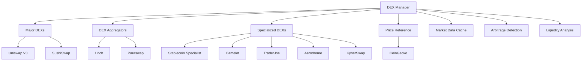

# DEX Manager Analysis Report

## Overview
The DEX Manager is the heart of the arbitrage system's market data collection, managing connections to 15+ decentralized exchanges and providing unified price discovery and liquidity analysis.

## Architecture



## Strengths

### 1. **Comprehensive DEX Coverage**
```python
# Excellent DEX diversity
dexs = {
    'uniswap_v3': UniswapV3Adapter,      # Largest liquidity
    'sushiswap': SushiSwapAdapter,       # Multi-chain
    '1inch': OneInchAdapter,             # Best execution
    'paraswap': ParaswapAdapter,         # MEV protection
    'stablecoin_specialist': StablecoinAdapter,  # Stable pairs
    'camelot': CamelotAdapter,           # Arbitrum native
    'traderjoe': TraderJoeAdapter,       # Avalanche/Arbitrum
    'aerodrome': AerodromeAdapter,       # Base native
    'kyberswap': KyberSwapAdapter        # Dynamic fees
}
```

### 2. **Robust Connection Management**
- **Async connection handling** with proper error recovery
- **Graceful degradation** when DEXs fail
- **Connection health monitoring** and automatic reconnection
- **Parallel initialization** for faster startup

### 3. **Intelligent Arbitrage Detection**
```python
def find_arbitrage_opportunities(self, min_profit_percentage: float = 0.5):
    # Smart common pair detection
    common_pairs = self._find_common_pairs(all_pairs)
    # Cross-DEX price comparison
    # Liquidity-aware opportunity sizing
    # Profit ranking and filtering
```

### 4. **Market Data Caching**
- **30-second TTL** for price data
- **Efficient memory usage** with automatic cleanup
- **Reduced API calls** and rate limiting compliance

## Weak Spots

### 1. **Limited Error Handling**
```python
# Current Issue: Basic error handling
except Exception as e:
    logger.error(f"Error connecting to {dex_name}: {e}")
    return False
```
- **Generic exception handling** without specific error types
- **No retry mechanisms** for transient failures
- **No circuit breaker** patterns for failing DEXs
- **Limited error context** for debugging

### 2. **Inefficient Pair Discovery**
```python
# Current Issue: Inefficient pair intersection
common_pairs = set.intersection(*pair_sets.values())
```
- **Memory intensive** for large DEX pair sets
- **No pair filtering** by volume or liquidity
- **Static pair discovery** without dynamic updates
- **No prioritization** of high-value pairs

### 3. **Missing Real-Time Features**
- **No WebSocket connections** for real-time price updates
- **Polling-based updates** create latency
- **No event-driven** arbitrage detection
- **Limited market depth** analysis

### 4. **Liquidity Analysis Gaps**
```python
# Current Issue: Basic liquidity estimation
max_trade_size_usd = min_liquidity * 0.01 if min_liquidity > 0 else 1000
```
- **Oversimplified liquidity calculation** (1% rule)
- **No slippage modeling** for large trades
- **Missing order book depth** analysis
- **No dynamic sizing** based on market conditions

## Critical Issues

### 1. **DEX Adapter Implementation Gaps**
**Priority: CRITICAL**
- Many adapters are **placeholder implementations**
- **Missing real API integrations** for smaller DEXs
- **No standardized interface** validation
- **Inconsistent error handling** across adapters

### 2. **Rate Limiting and API Management**
**Priority: HIGH**
- **No rate limiting** implementation
- **Missing API key rotation** for high-volume usage
- **No request queuing** for burst protection
- **Limited API quota monitoring**

### 3. **Data Quality and Validation**
**Priority: HIGH**
- **No price sanity checks** for outliers
- **Missing cross-validation** between DEXs
- **No stale data detection** mechanisms
- **Limited data integrity** verification

## Recommended Improvements

### 1. **Enhanced Error Handling**
```python
class DEXConnectionError(Exception):
    """Specific DEX connection errors"""
    pass

class DEXRateLimitError(Exception):
    """Rate limiting errors"""
    pass

async def _connect_dex_with_retry(self, dex_name: str, max_retries: int = 3):
    """Implement exponential backoff retry logic"""
    for attempt in range(max_retries):
        try:
            return await self._connect_dex(dex_name)
        except DEXRateLimitError:
            await asyncio.sleep(2 ** attempt)
        except DEXConnectionError as e:
            if attempt == max_retries - 1:
                raise e
            await asyncio.sleep(1)
```

### 2. **Intelligent Pair Filtering**
```python
def _filter_high_value_pairs(self, all_pairs: Dict) -> List[tuple]:
    """Filter pairs by volume and liquidity thresholds"""
    filtered_pairs = []
    for pair in common_pairs:
        if self._meets_volume_threshold(pair) and self._has_sufficient_liquidity(pair):
            filtered_pairs.append(pair)
    return sorted(filtered_pairs, key=self._get_pair_priority, reverse=True)
```

### 3. **Real-Time Data Integration**
```python
async def start_realtime_feeds(self):
    """Start WebSocket connections for real-time data"""
    for dex_name in self.connected_dexs:
        if hasattr(self.dexs[dex_name], 'start_websocket'):
            await self.dexs[dex_name].start_websocket()
```

### 4. **Advanced Liquidity Analysis**
```python
def calculate_optimal_trade_size(self, pair_data: Dict) -> float:
    """Calculate optimal trade size considering slippage"""
    # Implement sophisticated slippage modeling
    # Consider order book depth
    # Factor in historical volatility
    # Apply Kelly criterion for position sizing
```

## Performance Optimizations

### 1. **Connection Pooling**
```python
class DEXConnectionPool:
    """Manage persistent connections to DEXs"""
    def __init__(self, max_connections_per_dex: int = 5):
        self.pools = {}
        self.max_connections = max_connections_per_dex
```

### 2. **Batch Processing**
```python
async def get_batch_prices(self, pairs: List[tuple]) -> Dict:
    """Get prices for multiple pairs in batches"""
    batch_size = 10
    results = {}
    for i in range(0, len(pairs), batch_size):
        batch = pairs[i:i + batch_size]
        batch_results = await self._process_price_batch(batch)
        results.update(batch_results)
    return results
```

### 3. **Intelligent Caching**
```python
class SmartCache:
    """Cache with different TTLs based on pair volatility"""
    def get_ttl(self, pair: str) -> int:
        volatility = self.get_pair_volatility(pair)
        if volatility > 0.05:  # High volatility
            return 5  # 5 second cache
        elif volatility > 0.02:  # Medium volatility
            return 15  # 15 second cache
        else:  # Low volatility
            return 60  # 60 second cache
```

## Simplification Opportunities

### 1. **Reduce DEX Complexity**
- **Focus on top 5-7 DEXs** with highest volume
- **Remove redundant** smaller DEXs with low liquidity
- **Consolidate similar** DEX adapters

### 2. **Streamline Pair Discovery**
- **Pre-filter pairs** by minimum volume thresholds
- **Focus on major tokens** (ETH, USDC, USDT, WBTC)
- **Limit cross-chain pairs** to proven profitable routes

## Enhanced Functionality Ideas

### 1. **ML-Powered Opportunity Detection**
- **Pattern recognition** for recurring arbitrage opportunities
- **Predictive modeling** for price movements
- **Dynamic threshold adjustment** based on market conditions

### 2. **Advanced Market Making**
- **Provide liquidity** on smaller DEXs
- **Capture spread** while waiting for arbitrage opportunities
- **Inventory management** across multiple chains

### 3. **MEV Strategy Integration**
- **Sandwich attack detection** and avoidance
- **Front-running protection** mechanisms
- **Back-running opportunities** identification

## Risk Assessment

**Current Risk Level: MEDIUM**
- Good architectural foundation
- Missing critical implementation details
- Potential for API rate limiting issues

**Key Risks:**
1. **DEX API failures** could blind the system
2. **Rate limiting** could reduce opportunity detection
3. **Stale price data** could lead to failed trades
4. **Missing liquidity analysis** could cause slippage losses

## Next Steps

1. **Implement missing DEX adapters** (Week 1)
2. **Add comprehensive error handling** (Week 1-2)
3. **Implement rate limiting and retry logic** (Week 2)
4. **Add real-time WebSocket feeds** (Week 3)
5. **Enhance liquidity analysis** (Week 3-4)
6. **Add performance monitoring** (Week 4)
