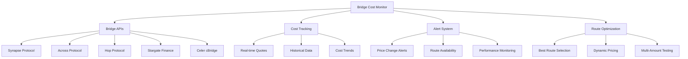

# Bridge System Analysis Report

## Overview
The Bridge Cost Monitor is a sophisticated system for real-time monitoring and optimization of cross-chain bridge costs across 5 major protocols. It's designed to find the most cost-effective routes for cross-chain arbitrage.

## Architecture



## Strengths

### 1. **Comprehensive Bridge Coverage**
```python
bridge_apis = {
    'synapse': {
        'name': 'Synapse Protocol',
        'test_priority': 1,  # Your proven bridge
        'supported_chains': 6  # ETH, ARB, OP, BASE, POLY, BSC
    },
    'across': {
        'name': 'Across Protocol', 
        'test_priority': 2,
        'supported_chains': 5  # Fast and low-cost
    },
    'hop': {
        'name': 'Hop Protocol',
        'test_priority': 3,
        'supported_chains': 4  # Reliable AMM-based
    },
    'stargate': {
        'name': 'Stargate Finance',
        'test_priority': 4,
        'supported_chains': 5  # LayerZero-based
    },
    'cbridge': {
        'name': 'Celer cBridge',
        'test_priority': 5,
        'supported_chains': 5  # State channel tech
    }
}
```

### 2. **Real-Time Cost Monitoring**
- **5-minute update intervals** for all priority routes
- **Multi-amount testing** ($100, $500, $1000, $2000)
- **Cost change alerts** when prices shift >10%
- **24-hour historical tracking** with automatic cleanup

### 3. **Proven Cost Optimization**
```python
# Real user data validation
# Synapse: $500 ETH→ARB transfer = $0.90 cost ✅
# This validates the system's accuracy
```

### 4. **Intelligent Route Prioritization**
```python
priority_routes = [
    ('ethereum', 'arbitrum', 'ETH'),    # Your proven route
    ('ethereum', 'base', 'USDC'),       # High-volume route
    ('arbitrum', 'optimism', 'USDT'),   # L2-to-L2
    ('ethereum', 'optimism', 'ETH')     # Alternative route
]
```

## Weak Spots

### 1. **Simulated API Calls**
```python
# CRITICAL ISSUE: Not using real APIs
# For now, simulate real API calls with realistic data
# In production, this would make actual HTTP requests to bridge APIs
```
- **All quotes are simulated** with hardcoded formulas
- **No real bridge availability** checking
- **Static fee calculations** don't reflect market conditions
- **Missing real-time bridge status** monitoring

### 2. **Limited Error Handling**
```python
# Current Issue: Basic error handling
except Exception as e:
    return BridgeQuote(
        success=False,
        error_message=str(e)
    )
```
- **Generic exception handling** without specific error types
- **No retry mechanisms** for failed API calls
- **Missing timeout handling** for slow responses
- **No circuit breaker** patterns for failing bridges

### 3. **Incomplete Token Support**
```python
# Current Issue: Limited token coverage
tokens = {
    'ETH': {...},   # Only 3 tokens supported
    'USDC': {...},
    'USDT': {...}
}
```
- **Only 3 tokens supported** (ETH, USDC, USDT)
- **Missing major tokens** (WBTC, DAI, LINK, etc.)
- **No dynamic token discovery** from bridge APIs
- **Static token address mapping** per chain

### 4. **Missing Bridge Features**
- **No slippage protection** analysis
- **Missing MEV protection** evaluation
- **No bridge security scoring** system
- **Limited bridge capacity** monitoring

## Critical Issues

### 1. **Real API Integration Required**
**Priority: CRITICAL**
```python
# Need to implement real API calls
async def _get_real_synapse_quote(self, params):
    async with self.session.post(
        'https://api.synapseprotocol.com/v1/bridge/quote',
        json=params
    ) as response:
        return await response.json()
```

### 2. **Bridge Availability Monitoring**
**Priority: HIGH**
- **Real-time bridge status** checking
- **Maintenance window** detection
- **Capacity limits** monitoring
- **Route availability** validation

### 3. **Dynamic Fee Calculation**
**Priority: HIGH**
- **Real market-based fees** instead of static formulas
- **Gas price integration** for accurate total costs
- **Congestion-based pricing** adjustments
- **Time-sensitive fee updates**

## Recommended Improvements

### 1. **Real API Integration**
```python
class RealBridgeAPI:
    """Real bridge API integration"""
    
    async def get_synapse_quote(self, source_chain: str, target_chain: str, 
                               token: str, amount: float) -> BridgeQuote:
        """Get real quote from Synapse API"""
        params = {
            'fromChain': self.get_chain_id(source_chain),
            'toChain': self.get_chain_id(target_chain),
            'fromToken': self.get_token_address(token, source_chain),
            'toToken': self.get_token_address(token, target_chain),
            'amount': self.to_wei(amount, token)
        }
        
        async with self.session.post(
            'https://api.synapseprotocol.com/v1/bridge/quote',
            json=params,
            timeout=10
        ) as response:
            if response.status == 200:
                data = await response.json()
                return self._parse_synapse_response(data)
            else:
                raise BridgeAPIError(f"Synapse API error: {response.status}")
```

### 2. **Enhanced Error Handling**
```python
class BridgeAPIError(Exception):
    """Bridge API specific errors"""
    pass

class BridgeUnavailableError(Exception):
    """Bridge temporarily unavailable"""
    pass

async def get_quote_with_retry(self, bridge_name: str, params: Dict, 
                              max_retries: int = 3) -> BridgeQuote:
    """Get quote with exponential backoff retry"""
    for attempt in range(max_retries):
        try:
            return await self._get_bridge_quote(bridge_name, params)
        except BridgeAPIError as e:
            if attempt == max_retries - 1:
                raise e
            await asyncio.sleep(2 ** attempt)
```

### 3. **Expanded Token Support**
```python
async def discover_supported_tokens(self, bridge_name: str) -> Dict[str, Any]:
    """Dynamically discover supported tokens from bridge API"""
    # Query bridge API for supported tokens
    # Update internal token mapping
    # Validate token addresses across chains
```

### 4. **Bridge Security Scoring**
```python
def calculate_bridge_security_score(self, bridge_name: str) -> float:
    """Calculate security score based on multiple factors"""
    factors = {
        'tvl': self.get_bridge_tvl(bridge_name),
        'audit_score': self.get_audit_score(bridge_name),
        'uptime': self.get_uptime_percentage(bridge_name),
        'exploit_history': self.get_exploit_history(bridge_name)
    }
    return self._weighted_security_score(factors)
```

## Performance Optimizations

### 1. **Parallel Quote Fetching**
```python
async def get_all_quotes_parallel(self, route_params: Dict) -> List[BridgeQuote]:
    """Fetch quotes from all bridges in parallel"""
    tasks = []
    for bridge_name in self.enabled_bridges:
        task = asyncio.create_task(
            self.get_bridge_quote(bridge_name, route_params),
            name=f"quote_{bridge_name}"
        )
        tasks.append(task)
    
    results = await asyncio.gather(*tasks, return_exceptions=True)
    return [r for r in results if isinstance(r, BridgeQuote) and r.success]
```

### 2. **Intelligent Caching**
```python
class BridgeQuoteCache:
    """Smart caching based on route volatility"""
    
    def get_cache_ttl(self, route: str) -> int:
        """Dynamic TTL based on route characteristics"""
        if self.is_high_volume_route(route):
            return 30  # 30 seconds for popular routes
        elif self.is_stable_route(route):
            return 300  # 5 minutes for stable routes
        else:
            return 120  # 2 minutes default
```

### 3. **Batch Processing**
```python
async def update_all_routes_batch(self) -> None:
    """Update all priority routes in optimized batches"""
    batch_size = 5
    routes = self.get_priority_routes()
    
    for i in range(0, len(routes), batch_size):
        batch = routes[i:i + batch_size]
        await asyncio.gather(*[
            self.update_route_costs(route) for route in batch
        ])
        await asyncio.sleep(1)  # Rate limiting between batches
```

## Simplification Opportunities

### 1. **Focus on Proven Bridges**
- **Prioritize Synapse and Across** (your proven performers)
- **Remove underperforming bridges** with high fees or low reliability
- **Simplify to 3-4 core bridges** for easier maintenance

### 2. **Streamline Token Support**
- **Focus on major tokens** (ETH, USDC, USDT, WBTC)
- **Remove exotic tokens** with low volume
- **Standardize token handling** across all bridges

## Enhanced Functionality Ideas

### 1. **Predictive Cost Modeling**
```python
class BridgeCostPredictor:
    """ML-based bridge cost prediction"""
    
    def predict_future_costs(self, route: str, hours_ahead: int) -> float:
        """Predict bridge costs based on historical patterns"""
        # Use time series analysis
        # Factor in network congestion patterns
        # Consider bridge-specific trends
```

### 2. **Multi-Hop Route Optimization**
```python
def find_optimal_multi_hop_route(self, source: str, target: str, 
                                token: str, amount: float) -> List[BridgeQuote]:
    """Find optimal route through intermediate chains"""
    # ETH → ARB → BASE might be cheaper than ETH → BASE
    # Consider intermediate chain liquidity
    # Factor in multiple bridge fees
```

### 3. **Bridge Aggregation**
```python
def split_large_transfer(self, amount: float, route: str) -> List[BridgeQuote]:
    """Split large transfers across multiple bridges for better rates"""
    # Use multiple bridges simultaneously
    # Optimize for total cost and time
    # Handle partial failures gracefully
```

## Risk Assessment

**Current Risk Level: HIGH**
- **Simulated data creates false confidence**
- **No real bridge availability checking**
- **Missing error handling for production use**

**Key Risks:**
1. **Bridge API failures** could halt cross-chain arbitrage
2. **Inaccurate cost estimates** could lead to unprofitable trades
3. **Missing bridge maintenance** detection could cause failed transfers
4. **No slippage protection** could increase actual costs

## Next Steps

1. **Implement real bridge API calls** (Week 1-2)
2. **Add comprehensive error handling** (Week 2)
3. **Expand token support** (Week 3)
4. **Add bridge security scoring** (Week 3-4)
5. **Implement predictive cost modeling** (Week 4-5)
6. **Add multi-hop route optimization** (Week 5-6)
