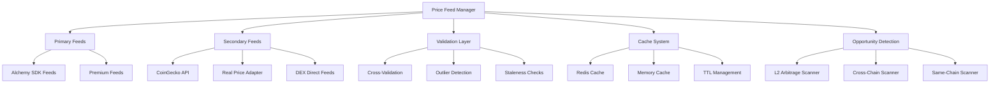

# Price Feeds Analysis Report

## Overview
The price feed system is the foundation of arbitrage opportunity detection, currently built around Alchemy SDK with multiple feed sources for comprehensive market coverage.

## Architecture



## Current Implementation Analysis

### Alchemy SDK Feeds (Primary)
```python
class AlchemySDKFeeds:
    """Primary price feed using Alchemy's enhanced APIs"""
    
    def __init__(self, config: Dict[str, Any]):
        self.alchemy_api_key = os.getenv('ALCHEMY_API_KEY')
        self.networks = {
            'ethereum': f"https://eth-mainnet.g.alchemy.com/v2/{self.alchemy_api_key}",
            'arbitrum': f"https://arb-mainnet.g.alchemy.com/v2/{self.alchemy_api_key}",
            'optimism': f"https://opt-mainnet.g.alchemy.com/v2/{self.alchemy_api_key}",
            'base': f"https://base-mainnet.g.alchemy.com/v2/{self.alchemy_api_key}",
            'polygon': f"https://polygon-mainnet.g.alchemy.com/v2/{self.alchemy_api_key}"
        }
```

## Strengths

### 1. **Multi-Chain Coverage**
- **5 major networks** supported through Alchemy
- **Consistent API interface** across all chains
- **High reliability** with enterprise-grade infrastructure
- **Real-time data** with low latency

### 2. **L2-Optimized Scanning**
```python
async def get_l2_arbitrage_opportunities(self, min_profit_percentage: float = 0.15):
    """Optimized for L2 chains with lower gas costs"""
    # Focus on Arbitrum, Optimism, Base
    # Lower profit thresholds for L2 efficiency
    # Cross-L2 arbitrage detection
```

### 3. **Comprehensive Token Support**
- **Major tokens** (ETH, USDC, USDT, WBTC, DAI)
- **Cross-chain token mapping** with proper address resolution
- **Automatic price normalization** across different decimals

### 4. **Built-in Caching**
- **Memory-based caching** for frequently accessed prices
- **TTL management** to balance freshness vs performance
- **Batch processing** for multiple token requests

## Weak Spots

### 1. **Single Point of Failure**
```python
# CRITICAL ISSUE: Only one primary feed source
self.price_feeds = AlchemySDKFeeds(self.config)
if not await self.price_feeds.connect():
    logger.error("Failed to initialize price feeds")
    return False  # System fails completely
```
- **No fallback mechanisms** if Alchemy fails
- **No redundancy** across multiple providers
- **Complete system failure** if primary feed is down

### 2. **Limited Price Validation**
```python
# Current Issue: No cross-validation
price = await self.get_token_price(token, chain)
# Price is used directly without validation
```
- **No outlier detection** for suspicious prices
- **No cross-validation** between multiple sources
- **Missing sanity checks** for price reasonableness
- **No stale data detection** mechanisms

### 3. **Rate Limiting Concerns**
```python
# Current Issue: No rate limiting management
# Alchemy free tier has limits that could be exceeded
```
- **No request queuing** for burst protection
- **Missing rate limit monitoring** and alerts
- **No automatic throttling** when limits approached
- **Potential service interruption** during high activity

### 4. **Incomplete Market Data**
- **Missing liquidity information** for accurate sizing
- **No order book depth** analysis
- **Limited historical data** for trend analysis
- **No volatility metrics** for risk assessment

## Critical Issues

### 1. **Feed Redundancy Implementation**
**Priority: CRITICAL**
```python
class RedundantPriceFeedManager:
    """Multi-source price feed with automatic failover"""
    
    def __init__(self):
        self.primary_feeds = [AlchemySDKFeeds, PremiumFeeds]
        self.secondary_feeds = [CoinGeckoAdapter, DEXDirectFeeds]
        self.validation_threshold = 0.02  # 2% price deviation tolerance
    
    async def get_validated_price(self, token: str, chain: str) -> float:
        """Get price with cross-validation"""
        prices = await self._get_prices_from_multiple_sources(token, chain)
        validated_price = self._validate_and_select_price(prices)
        return validated_price
```

### 2. **Real-Time Data Streaming**
**Priority: HIGH**
```python
class WebSocketPriceFeeds:
    """Real-time price streaming via WebSocket"""
    
    async def start_price_stream(self, tokens: List[str]):
        """Start real-time price streaming"""
        # Connect to multiple WebSocket feeds
        # Handle reconnections automatically
        # Emit price updates to arbitrage scanner
```

### 3. **Advanced Market Data**
**Priority: HIGH**
```python
class EnhancedMarketData:
    """Comprehensive market data beyond just prices"""
    
    async def get_market_depth(self, token: str, chain: str) -> Dict:
        """Get order book depth and liquidity"""
        return {
            'bid_depth': self._get_bid_depth(token, chain),
            'ask_depth': self._get_ask_depth(token, chain),
            'spread': self._calculate_spread(token, chain),
            'liquidity_score': self._calculate_liquidity_score(token, chain)
        }
```

## Recommended Improvements

### 1. **Multi-Source Price Validation**
```python
class PriceValidator:
    """Validate prices across multiple sources"""
    
    def validate_price(self, prices: Dict[str, float], token: str) -> float:
        """Validate and select best price"""
        if len(prices) < 2:
            return list(prices.values())[0]  # Single source
        
        # Remove outliers
        clean_prices = self._remove_outliers(prices)
        
        # Weight by source reliability
        weighted_price = self._calculate_weighted_average(clean_prices)
        
        # Validate against historical data
        if self._is_price_reasonable(weighted_price, token):
            return weighted_price
        else:
            raise PriceValidationError(f"Unreasonable price for {token}")
```

### 2. **Intelligent Caching Strategy**
```python
class SmartPriceCache:
    """Dynamic caching based on token volatility"""
    
    def get_cache_ttl(self, token: str) -> int:
        """Dynamic TTL based on token characteristics"""
        volatility = self.get_token_volatility(token)
        volume = self.get_token_volume(token)
        
        if volatility > 0.05 or volume > 1000000:  # High volatility/volume
            return 5  # 5 second cache
        elif volatility > 0.02 or volume > 100000:  # Medium
            return 15  # 15 second cache
        else:  # Low volatility/volume
            return 60  # 60 second cache
```

### 3. **Rate Limiting Management**
```python
class RateLimitManager:
    """Manage API rate limits across all feeds"""
    
    def __init__(self):
        self.limits = {
            'alchemy': {'requests_per_second': 10, 'daily_limit': 100000},
            'coingecko': {'requests_per_minute': 50, 'monthly_limit': 10000}
        }
        self.usage_tracking = {}
    
    async def make_request(self, provider: str, request_func):
        """Make rate-limited request"""
        if self._can_make_request(provider):
            result = await request_func()
            self._track_usage(provider)
            return result
        else:
            await self._wait_for_rate_limit_reset(provider)
            return await self.make_request(provider, request_func)
```

### 4. **Historical Data Integration**
```python
class HistoricalPriceAnalyzer:
    """Analyze historical price patterns"""
    
    def detect_anomalies(self, current_price: float, token: str) -> bool:
        """Detect price anomalies using historical data"""
        historical_prices = self.get_recent_prices(token, hours=24)
        
        # Statistical analysis
        mean_price = statistics.mean(historical_prices)
        std_dev = statistics.stdev(historical_prices)
        
        # Z-score analysis
        z_score = abs((current_price - mean_price) / std_dev)
        
        return z_score > 3  # More than 3 standard deviations
```

## Performance Optimizations

### 1. **Batch Price Fetching**
```python
async def get_batch_prices(self, token_chain_pairs: List[tuple]) -> Dict:
    """Fetch multiple prices in optimized batches"""
    batch_size = 20
    results = {}
    
    for i in range(0, len(token_chain_pairs), batch_size):
        batch = token_chain_pairs[i:i + batch_size]
        batch_results = await self._fetch_price_batch(batch)
        results.update(batch_results)
        
        # Rate limiting between batches
        await asyncio.sleep(0.1)
    
    return results
```

### 2. **Connection Pooling**
```python
class PriceFeedConnectionPool:
    """Manage persistent connections to price feeds"""
    
    def __init__(self, max_connections: int = 10):
        self.session_pool = aiohttp.ClientSession(
            connector=aiohttp.TCPConnector(limit=max_connections),
            timeout=aiohttp.ClientTimeout(total=30)
        )
```

### 3. **Predictive Caching**
```python
class PredictiveCache:
    """Cache prices before they're needed"""
    
    async def preload_likely_needed_prices(self):
        """Preload prices for tokens likely to be needed"""
        # Analyze historical arbitrage patterns
        # Preload prices for frequently arbitraged tokens
        # Cache prices for all major trading pairs
```

## Simplification Opportunities

### 1. **Focus on Core Tokens**
- **Limit to 10-15 major tokens** (ETH, USDC, USDT, WBTC, DAI, etc.)
- **Remove exotic tokens** with low arbitrage potential
- **Standardize token handling** across all chains

### 2. **Streamline Chain Support**
- **Focus on L2 chains** (Arbitrum, Optimism, Base) for lower costs
- **Reduce mainnet exposure** due to high gas costs
- **Prioritize proven profitable routes**

## Enhanced Functionality Ideas

### 1. **ML-Powered Price Prediction**
```python
class PricePredictionModel:
    """Machine learning price prediction"""
    
    def predict_price_movement(self, token: str, timeframe_minutes: int) -> Dict:
        """Predict price movement for arbitrage timing"""
        # Use LSTM neural networks
        # Factor in market sentiment
        # Consider cross-chain price correlations
```

### 2. **Market Microstructure Analysis**
```python
class MicrostructureAnalyzer:
    """Analyze market microstructure for better execution"""
    
    def analyze_order_flow(self, token: str, chain: str) -> Dict:
        """Analyze order flow patterns"""
        # Detect large orders
        # Identify market maker behavior
        # Predict short-term price impact
```

### 3. **Cross-Chain Price Correlation**
```python
class CrossChainCorrelationAnalyzer:
    """Analyze price correlations across chains"""
    
    def find_leading_indicators(self, token: str) -> Dict:
        """Find which chain leads price discovery"""
        # Identify price leadership patterns
        # Predict cross-chain arbitrage opportunities
        # Optimize execution timing
```

## Risk Assessment

**Current Risk Level: MEDIUM-HIGH**
- **Single point of failure** creates system vulnerability
- **No price validation** could lead to bad trades
- **Rate limiting** could interrupt operations

**Key Risks:**
1. **Alchemy API failure** would halt entire system
2. **Bad price data** could trigger unprofitable trades
3. **Rate limit exceeded** could blind arbitrage detection
4. **Stale data** could cause execution on outdated prices

## Next Steps

1. **Implement price feed redundancy** (Week 1)
2. **Add cross-validation mechanisms** (Week 1-2)
3. **Implement rate limiting management** (Week 2)
4. **Add real-time WebSocket feeds** (Week 2-3)
5. **Enhance market data collection** (Week 3-4)
6. **Add predictive analytics** (Week 4-5)
