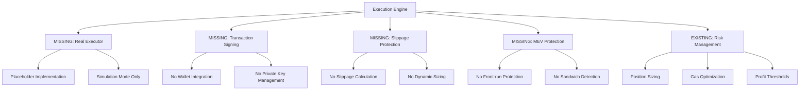

# Execution Engine Analysis Report

## Overview
The execution engine is the most critical component for live trading, responsible for converting arbitrage opportunities into actual profitable trades. Currently, this is the weakest part of the system with significant implementation gaps.

## Current State Analysis



## Critical Missing Components

### 1. **Real Execution Implementation**
```python
# CURRENT STATE: Placeholder
async def _execute_single_opportunity(self, opportunity: Dict[str, Any], wallet_private_key: str = None):
    """Execute a single arbitrage opportunity."""
    try:
        # MISSING: Actual execution logic
        logger.info(f"🚀 SIMULATED execution of {opportunity['token']} arbitrage")
        
        # MISSING: Transaction building
        # MISSING: Gas estimation
        # MISSING: Slippage protection
        # MISSING: Transaction signing
        # MISSING: Transaction broadcasting
        # MISSING: Transaction monitoring
        
        # Simulate success
        await asyncio.sleep(2)
        return ArbitrageExecution(
            opportunity_id=opportunity['opportunity_id'],
            success=True,  # Always succeeds in simulation
            profit_usd=opportunity.get('estimated_net_profit_usd', 0),
            # ... rest is simulated
        )
```

### 2. **Transaction Management**
```python
# NEEDED: Complete transaction management system
class TransactionManager:
    """MISSING: Handle all transaction lifecycle"""
    
    async def build_arbitrage_transaction(self, opportunity: Dict) -> Dict:
        """Build transaction for arbitrage execution"""
        # MISSING: Smart contract interaction
        # MISSING: Multi-step transaction coordination
        # MISSING: Gas estimation and optimization
        # MISSING: Slippage calculation
        
    async def sign_and_broadcast(self, transaction: Dict, private_key: str) -> str:
        """Sign and broadcast transaction"""
        # MISSING: Secure key handling
        # MISSING: Transaction signing
        # MISSING: Broadcasting to network
        # MISSING: Transaction hash return
        
    async def monitor_transaction(self, tx_hash: str) -> Dict:
        """Monitor transaction status"""
        # MISSING: Transaction confirmation tracking
        # MISSING: Failure detection and handling
        # MISSING: Gas price adjustment for stuck transactions
```

### 3. **Wallet Integration**
```python
# NEEDED: Secure wallet management
class WalletManager:
    """MISSING: Secure wallet operations"""
    
    def __init__(self, private_key: str):
        # MISSING: Secure key storage
        # MISSING: Key encryption/decryption
        # MISSING: Multi-wallet support
        
    async def get_balance(self, token: str, chain: str) -> float:
        """Get token balance"""
        # MISSING: Balance checking across chains
        
    async def approve_token(self, token: str, spender: str, amount: float) -> str:
        """Approve token spending"""
        # MISSING: Token approval management
        
    async def estimate_gas(self, transaction: Dict) -> int:
        """Estimate gas for transaction"""
        # MISSING: Accurate gas estimation
```

## Strengths (Risk Management Framework)

### 1. **Gas Optimization System**
```python
# EXISTING: Excellent gas optimization
gas_settings = {
    'l2_gas_thresholds': {
        'ultra_low': 0.1,    # Perfect for L2 arbitrage ✅
        'low': 0.5,          # Good for L2 arbitrage ✅
        'medium': 2.0,       # Marginal for L2 arbitrage ✅
        'high': 5.0,         # Bad for L2 arbitrage ✅
        'extreme': 10.0      # Never trade on L2 ✅
    }
}
```

### 2. **Position Sizing Controls**
```python
# EXISTING: Good position management
execution_settings = {
    'min_profit_usd': 0.50,
    'max_trade_size_usd': 5000,
    'max_concurrent_executions': 3,
    'max_execution_time_seconds': 300
}
```

### 3. **Profit Threshold Management**
```python
# EXISTING: Dynamic profit thresholds
def _estimate_net_profit(self, opportunity: Dict[str, Any]) -> float:
    """Estimate net profit with gas optimization"""
    # Considers gas costs
    # Factors in bridge fees
    # Accounts for slippage (basic)
```

## Critical Implementation Needs

### 1. **Smart Contract Integration**
```python
class ArbitrageExecutor:
    """NEEDED: Smart contract execution engine"""
    
    def __init__(self, config: Dict):
        self.web3_connections = {}  # Web3 connections per chain
        self.contract_addresses = {}  # DEX contract addresses
        self.abi_cache = {}  # Contract ABIs
        
    async def execute_same_chain_arbitrage(self, opportunity: Dict) -> ArbitrageExecution:
        """Execute same-chain arbitrage"""
        # 1. Build swap transactions
        # 2. Calculate optimal path
        # 3. Execute atomic transaction
        # 4. Monitor for completion
        
    async def execute_cross_chain_arbitrage(self, opportunity: Dict) -> ArbitrageExecution:
        """Execute cross-chain arbitrage"""
        # 1. Execute first leg on source chain
        # 2. Initiate bridge transfer
        # 3. Monitor bridge completion
        # 4. Execute second leg on target chain
        # 5. Coordinate multi-chain state
```

### 2. **MEV Protection**
```python
class MEVProtection:
    """NEEDED: Protection against MEV attacks"""
    
    async def detect_sandwich_risk(self, transaction: Dict) -> float:
        """Detect sandwich attack risk"""
        # Analyze mempool for competing transactions
        # Calculate potential sandwich profit
        # Return risk score
        
    async def use_private_mempool(self, transaction: Dict) -> str:
        """Submit transaction via private mempool"""
        # Use Flashbots or similar
        # Avoid public mempool exposure
        # Reduce MEV risk
        
    def calculate_mev_adjusted_slippage(self, base_slippage: float, mev_risk: float) -> float:
        """Adjust slippage for MEV protection"""
        # Increase slippage tolerance based on MEV risk
        # Balance protection vs execution probability
```

### 3. **Flash Loan Integration**
```python
class FlashLoanExecutor:
    """NEEDED: Flash loan arbitrage execution"""
    
    async def execute_flash_loan_arbitrage(self, opportunity: Dict) -> ArbitrageExecution:
        """Execute arbitrage using flash loans"""
        # 1. Calculate required loan amount
        # 2. Build flash loan transaction
        # 3. Include arbitrage logic in callback
        # 4. Ensure profitability after fees
        # 5. Execute atomic transaction
        
    def calculate_flash_loan_profitability(self, opportunity: Dict) -> float:
        """Calculate profitability including flash loan fees"""
        # Factor in flash loan fees (typically 0.05-0.09%)
        # Consider gas costs for complex transaction
        # Account for slippage on larger trades
```

## Recommended Implementation Plan

### Phase 1: Basic Execution (Week 1-2)
```python
class BasicArbitrageExecutor:
    """Minimal viable execution engine"""
    
    async def execute_simple_arbitrage(self, opportunity: Dict) -> ArbitrageExecution:
        """Execute basic same-chain arbitrage"""
        try:
            # 1. Validate opportunity is still profitable
            current_prices = await self.get_current_prices(opportunity)
            if not self.is_still_profitable(current_prices, opportunity):
                return self.create_failed_execution("Opportunity expired")
            
            # 2. Build transaction
            transaction = await self.build_swap_transaction(opportunity)
            
            # 3. Estimate gas and adjust
            gas_estimate = await self.estimate_gas(transaction)
            transaction['gas'] = int(gas_estimate * 1.2)  # 20% buffer
            
            # 4. Sign and broadcast
            signed_tx = self.sign_transaction(transaction)
            tx_hash = await self.broadcast_transaction(signed_tx)
            
            # 5. Monitor completion
            receipt = await self.wait_for_confirmation(tx_hash)
            
            # 6. Calculate actual profit
            actual_profit = await self.calculate_actual_profit(receipt, opportunity)
            
            return ArbitrageExecution(
                opportunity_id=opportunity['opportunity_id'],
                success=receipt['status'] == 1,
                profit_usd=actual_profit,
                transaction_hashes=[tx_hash],
                execution_time_seconds=(datetime.now() - start_time).total_seconds()
            )
            
        except Exception as e:
            logger.error(f"Execution failed: {e}")
            return self.create_failed_execution(str(e))
```

### Phase 2: Advanced Features (Week 3-4)
```python
class AdvancedArbitrageExecutor(BasicArbitrageExecutor):
    """Advanced execution with MEV protection and flash loans"""
    
    async def execute_protected_arbitrage(self, opportunity: Dict) -> ArbitrageExecution:
        """Execute arbitrage with MEV protection"""
        # 1. Analyze MEV risk
        mev_risk = await self.mev_protection.detect_sandwich_risk(opportunity)
        
        # 2. Choose execution strategy
        if mev_risk > 0.7:  # High MEV risk
            return await self.execute_via_private_mempool(opportunity)
        elif mev_risk > 0.3:  # Medium MEV risk
            return await self.execute_with_increased_slippage(opportunity)
        else:  # Low MEV risk
            return await self.execute_simple_arbitrage(opportunity)
    
    async def execute_flash_loan_arbitrage(self, opportunity: Dict) -> ArbitrageExecution:
        """Execute arbitrage using flash loans for larger size"""
        # 1. Calculate optimal loan amount
        loan_amount = self.calculate_optimal_loan_size(opportunity)
        
        # 2. Build flash loan transaction
        flash_loan_tx = await self.build_flash_loan_transaction(
            loan_amount, opportunity
        )
        
        # 3. Execute atomic transaction
        return await self.execute_atomic_transaction(flash_loan_tx)
```

### Phase 3: Cross-Chain Execution (Week 5-6)
```python
class CrossChainExecutor(AdvancedArbitrageExecutor):
    """Cross-chain arbitrage execution"""
    
    async def execute_cross_chain_arbitrage(self, opportunity: Dict) -> ArbitrageExecution:
        """Execute cross-chain arbitrage with bridge coordination"""
        try:
            # 1. Execute first leg
            first_leg_result = await self.execute_first_leg(opportunity)
            if not first_leg_result.success:
                return first_leg_result
            
            # 2. Initiate bridge transfer
            bridge_result = await self.execute_bridge_transfer(opportunity)
            if not bridge_result.success:
                # Handle partial execution
                return await self.handle_bridge_failure(first_leg_result, opportunity)
            
            # 3. Execute second leg
            second_leg_result = await self.execute_second_leg(opportunity)
            
            # 4. Combine results
            return self.combine_execution_results([
                first_leg_result, bridge_result, second_leg_result
            ])
            
        except Exception as e:
            logger.error(f"Cross-chain execution failed: {e}")
            return self.create_failed_execution(str(e))
```

## Risk Mitigation Strategies

### 1. **Transaction Failure Handling**
```python
class ExecutionFailureHandler:
    """Handle various execution failures"""
    
    async def handle_slippage_failure(self, opportunity: Dict) -> ArbitrageExecution:
        """Handle excessive slippage"""
        # Retry with higher slippage tolerance
        # Or abandon if slippage too high
        
    async def handle_gas_price_spike(self, opportunity: Dict) -> ArbitrageExecution:
        """Handle sudden gas price increases"""
        # Recalculate profitability
        # Adjust gas price or abandon
        
    async def handle_liquidity_shortage(self, opportunity: Dict) -> ArbitrageExecution:
        """Handle insufficient liquidity"""
        # Reduce trade size
        # Split across multiple DEXs
```

### 2. **Emergency Procedures**
```python
class EmergencyProcedures:
    """Emergency stop and recovery procedures"""
    
    async def emergency_stop(self):
        """Stop all active executions"""
        # Cancel pending transactions
        # Mark system as stopped
        # Notify operators
        
    async def recover_stuck_funds(self, chain: str) -> Dict:
        """Recover funds from failed transactions"""
        # Identify stuck funds
        # Build recovery transactions
        # Execute with higher gas prices
```

## Performance Optimizations

### 1. **Parallel Execution**
```python
async def execute_multiple_opportunities(self, opportunities: List[Dict]) -> List[ArbitrageExecution]:
    """Execute multiple opportunities in parallel"""
    # Ensure no token conflicts
    # Execute non-conflicting opportunities simultaneously
    # Monitor all executions concurrently
```

### 2. **Transaction Batching**
```python
async def batch_similar_transactions(self, opportunities: List[Dict]) -> ArbitrageExecution:
    """Batch similar transactions for gas efficiency"""
    # Combine multiple swaps in single transaction
    # Reduce gas costs through batching
    # Maintain atomic execution guarantees
```

## Risk Assessment

**Current Risk Level: CRITICAL**
- **No real execution capability** - system cannot trade
- **Missing all security features** - vulnerable to MEV attacks
- **No transaction management** - cannot handle failures
- **No wallet integration** - cannot access funds

**Implementation Priority:**
1. **Basic execution engine** (CRITICAL - Week 1)
2. **Wallet integration** (CRITICAL - Week 1)
3. **Transaction management** (HIGH - Week 2)
4. **MEV protection** (HIGH - Week 3)
5. **Flash loan integration** (MEDIUM - Week 4)
6. **Cross-chain coordination** (MEDIUM - Week 5)

## Next Steps

1. **Implement basic wallet integration** (Days 1-3)
2. **Build simple same-chain executor** (Days 4-7)
3. **Add transaction monitoring** (Days 8-10)
4. **Implement slippage protection** (Days 11-14)
5. **Add MEV protection** (Week 3)
6. **Test on testnet extensively** (Week 4)
7. **Deploy with small amounts** (Week 5)
