# Risk Management Analysis Report

## Overview
The risk management system is one of the strongest components of the arbitrage bot, featuring sophisticated gas optimization, position sizing, and profit threshold management. However, it lacks some critical real-world trading protections.

## Architecture

```mermaid
graph TB
    A[Risk Management System] --> B[Gas Optimization]
    A --> C[Position Sizing]
    A --> D[Profit Thresholds]
    A --> E[Execution Limits]
    A --> F[Emergency Controls]
    
    B --> B1[L2 Gas Thresholds]
    B --> B2[Mainnet Gas Thresholds]
    B --> B3[Dynamic Gas Pricing]
    B --> B4[Gas Category System]
    
    C --> C1[Max Trade Size]
    C --> C2[Liquidity-Based Sizing]
    C --> C3[Capital Allocation]
    C --> C4[Risk-Adjusted Sizing]
    
    D --> D1[Minimum Profit USD]
    D --> D2[Profit Percentage]
    D --> D3[Gas-Adjusted Profits]
    D --> D4[Chain-Specific Thresholds]
    
    E --> E1[Concurrent Execution Limits]
    E --> E2[Execution Timeouts]
    E --> E3[Duplicate Prevention]
    E --> E4[Route Validation]
    
    F --> F1[Signal Handlers]
    F --> F2[Emergency Stop]
    F --> F3[Circuit Breakers]
    F --> F4[Performance Monitoring]
```



## Strengths

### 1. **Sophisticated Gas Optimization**
```python
# EXCELLENT: L2-optimized gas management
gas_settings = {
    'l2_gas_thresholds': {
        'ultra_low': 0.1,    # Perfect for L2 arbitrage
        'low': 0.5,          # Good for L2 arbitrage  
        'medium': 2.0,       # Marginal for L2 arbitrage
        'high': 5.0,         # Bad for L2 arbitrage
        'extreme': 10.0      # Never trade on L2
    },
    'l2_min_profit_after_gas': {
        'ultra_low': 0.02,   # $0.02 minimum on L2
        'low': 0.05,         # $0.05 minimum on L2
        'medium': 0.25,      # $0.25 minimum on L2
        'high': 1.00,        # $1.00 minimum on L2
        'extreme': float('inf')  # Never trade
    }
}
```

### 2. **Dynamic Profit Threshold Management**
```python
def _estimate_net_profit(self, opportunity: Dict[str, Any]) -> float:
    """EXCELLENT: Comprehensive profit estimation"""
    # ✅ Considers trade size limits
    # ✅ Factors in gas costs by chain
    # ✅ Includes bridge fees for cross-chain
    # ✅ Accounts for different cost structures
    
    if opportunity['source_chain'] == opportunity['target_chain']:
        # Same-chain: only gas costs
        gas_costs = self._estimate_gas_cost_usd('arbitrage', chain=source_chain)
        estimated_costs = gas_costs
    else:
        # Cross-chain: bridge + gas costs
        bridge_fee = trade_size * 0.0005  # 0.05% estimate
        gas_costs = self._estimate_gas_cost_usd('cross_chain', chain=source_chain)
        estimated_costs = bridge_fee + gas_costs
```

### 3. **Intelligent Position Sizing**
```python
execution_settings = {
    'min_profit_usd': 0.50,              # ✅ Reasonable minimum
    'max_trade_size_usd': 5000,          # ✅ Conservative sizing
    'max_concurrent_executions': 3,       # ✅ Prevents overexposure
    'max_execution_time_seconds': 300     # ✅ Timeout protection
}
```

### 4. **Chain-Specific Risk Management**
```python
def _categorize_gas_price(self, gas_price_gwei: float, chain: str = 'ethereum') -> str:
    """EXCELLENT: Chain-aware gas categorization"""
    # Use L2 thresholds for L2 chains
    if chain in ['arbitrum', 'optimism', 'base', 'polygon']:
        thresholds = self.gas_settings['l2_gas_thresholds']
    else:
        thresholds = self.gas_settings['mainnet_gas_thresholds']
```

### 5. **Comprehensive Execution Controls**
```python
def _is_duplicate_execution(self, opportunity: Dict[str, Any]) -> bool:
    """GOOD: Prevents duplicate executions"""
    route_key = f"{opportunity['token']}_{opportunity['source_chain']}_{opportunity['target_chain']}"
    # Check active executions to prevent conflicts
```

## Weak Spots

### 1. **Missing Slippage Protection**
```python
# CRITICAL ISSUE: No slippage management
def _estimate_net_profit(self, opportunity: Dict[str, Any]) -> float:
    # Missing: Slippage calculation
    # Missing: Market impact estimation
    # Missing: Liquidity depth analysis
    # Missing: Dynamic slippage adjustment
```

### 2. **No MEV Protection**
```python
# CRITICAL ISSUE: No MEV risk assessment
async def _execute_opportunities(self, opportunities: List[Dict[str, Any]]):
    # Missing: Sandwich attack detection
    # Missing: Front-running protection
    # Missing: Private mempool usage
    # Missing: MEV-aware execution timing
```

### 3. **Limited Market Risk Management**
```python
# MISSING: Market volatility assessment
# MISSING: Correlation risk management
# MISSING: Concentration limits per token
# MISSING: Maximum daily loss limits
# MISSING: Drawdown protection
```

### 4. **Insufficient Error Handling**
```python
# CURRENT ISSUE: Basic error handling
except Exception as e:
    logger.error(f"Opportunity execution error: {e}")
    # Missing: Specific error categorization
    # Missing: Recovery procedures
    # Missing: Risk escalation protocols
```

## Critical Missing Components

### 1. **Slippage Management System**
```python
class SlippageManager:
    """NEEDED: Comprehensive slippage protection"""
    
    def calculate_expected_slippage(self, token: str, chain: str, trade_size: float) -> float:
        """Calculate expected slippage based on liquidity"""
        # Analyze order book depth
        # Consider historical slippage data
        # Factor in market volatility
        # Account for trade size impact
        
    def get_max_acceptable_slippage(self, opportunity: Dict) -> float:
        """Calculate maximum acceptable slippage"""
        profit_margin = opportunity['profit_percentage']
        
        # Conservative slippage limits based on profit margin
        if profit_margin > 2.0:    # High profit
            return 0.5  # 0.5% max slippage
        elif profit_margin > 1.0:  # Medium profit
            return 0.3  # 0.3% max slippage
        else:  # Low profit
            return 0.1  # 0.1% max slippage
    
    def adjust_trade_size_for_slippage(self, base_size: float, expected_slippage: float) -> float:
        """Reduce trade size if slippage too high"""
        if expected_slippage > 0.5:  # High slippage
            return base_size * 0.5  # Reduce by 50%
        elif expected_slippage > 0.3:  # Medium slippage
            return base_size * 0.7  # Reduce by 30%
        else:
            return base_size  # No reduction needed
```

### 2. **MEV Protection System**
```python
class MEVProtectionManager:
    """NEEDED: MEV attack protection"""
    
    def assess_mev_risk(self, opportunity: Dict) -> float:
        """Assess MEV risk for opportunity"""
        # Analyze mempool for competing transactions
        # Check for large pending transactions
        # Evaluate sandwich attack profitability
        # Return risk score 0-1
        
    def get_mev_protection_strategy(self, mev_risk: float) -> str:
        """Choose MEV protection strategy"""
        if mev_risk > 0.8:
            return "private_mempool"  # Use Flashbots
        elif mev_risk > 0.5:
            return "increased_slippage"  # Higher slippage tolerance
        elif mev_risk > 0.3:
            return "delayed_execution"  # Wait for better timing
        else:
            return "standard"  # Normal execution
    
    async def execute_with_mev_protection(self, opportunity: Dict, strategy: str) -> Dict:
        """Execute with appropriate MEV protection"""
        if strategy == "private_mempool":
            return await self.execute_via_flashbots(opportunity)
        elif strategy == "increased_slippage":
            return await self.execute_with_higher_slippage(opportunity)
        # ... other strategies
```

### 3. **Market Risk Management**
```python
class MarketRiskManager:
    """NEEDED: Comprehensive market risk management"""
    
    def __init__(self):
        self.position_limits = {
            'max_exposure_per_token': 0.3,  # 30% of capital per token
            'max_daily_loss': 0.05,         # 5% daily loss limit
            'max_drawdown': 0.15,           # 15% maximum drawdown
            'correlation_limit': 0.7        # Max correlation between positions
        }
    
    def check_position_limits(self, new_opportunity: Dict) -> bool:
        """Check if new position violates limits"""
        # Check token concentration
        # Verify daily loss limits
        # Assess correlation risk
        # Validate total exposure
        
    def calculate_position_size(self, opportunity: Dict, available_capital: float) -> float:
        """Calculate optimal position size using Kelly criterion"""
        win_probability = self.estimate_win_probability(opportunity)
        avg_win = opportunity['profit_percentage'] / 100
        avg_loss = self.estimate_avg_loss(opportunity)
        
        # Kelly formula: f = (bp - q) / b
        # where b = odds, p = win prob, q = loss prob
        kelly_fraction = (win_probability * avg_win - (1 - win_probability) * avg_loss) / avg_win
        
        # Conservative sizing (25% of Kelly)
        conservative_fraction = kelly_fraction * 0.25
        
        return min(
            available_capital * conservative_fraction,
            self.execution_settings['max_trade_size_usd']
        )
```

### 4. **Circuit Breaker System**
```python
class CircuitBreakerManager:
    """NEEDED: Automated circuit breakers"""
    
    def __init__(self):
        self.breakers = {
            'consecutive_losses': {'threshold': 5, 'cooldown_minutes': 30},
            'daily_loss_limit': {'threshold': 0.05, 'cooldown_hours': 24},
            'execution_failure_rate': {'threshold': 0.3, 'cooldown_minutes': 15},
            'gas_price_spike': {'threshold': 100, 'cooldown_minutes': 10}
        }
        self.breaker_states = {}
    
    def check_circuit_breakers(self) -> Dict[str, bool]:
        """Check all circuit breaker conditions"""
        breaker_status = {}
        
        # Check consecutive losses
        recent_losses = self.get_recent_consecutive_losses()
        if recent_losses >= self.breakers['consecutive_losses']['threshold']:
            breaker_status['consecutive_losses'] = True
            self.trigger_breaker('consecutive_losses')
        
        # Check daily loss limit
        daily_loss_pct = self.get_daily_loss_percentage()
        if daily_loss_pct >= self.breakers['daily_loss_limit']['threshold']:
            breaker_status['daily_loss_limit'] = True
            self.trigger_breaker('daily_loss_limit')
        
        # Check execution failure rate
        failure_rate = self.get_execution_failure_rate()
        if failure_rate >= self.breakers['execution_failure_rate']['threshold']:
            breaker_status['execution_failure_rate'] = True
            self.trigger_breaker('execution_failure_rate')
        
        return breaker_status
    
    def trigger_breaker(self, breaker_name: str):
        """Trigger circuit breaker"""
        logger.warning(f"🚨 CIRCUIT BREAKER TRIGGERED: {breaker_name}")
        self.breaker_states[breaker_name] = {
            'triggered_at': datetime.now(),
            'cooldown_until': datetime.now() + timedelta(
                minutes=self.breakers[breaker_name].get('cooldown_minutes', 0),
                hours=self.breakers[breaker_name].get('cooldown_hours', 0)
            )
        }
        # Stop all trading activity
        self.emergency_stop()
```

## Recommended Improvements

### 1. **Enhanced Gas Management**
```python
class AdvancedGasManager:
    """Enhanced gas management with predictive capabilities"""
    
    async def predict_gas_price_trend(self, chain: str, minutes_ahead: int = 10) -> Dict:
        """Predict gas price trends"""
        # Analyze historical gas price patterns
        # Consider network congestion indicators
        # Factor in pending transaction volume
        # Return trend prediction and confidence
        
    def optimize_execution_timing(self, opportunity: Dict, gas_prediction: Dict) -> datetime:
        """Optimize execution timing based on gas predictions"""
        # If gas prices expected to drop, delay execution
        # If opportunity might expire, execute immediately
        # Balance gas savings vs opportunity risk
```

### 2. **Dynamic Risk Adjustment**
```python
class DynamicRiskAdjuster:
    """Adjust risk parameters based on market conditions"""
    
    def adjust_risk_parameters(self, market_conditions: Dict):
        """Dynamically adjust risk parameters"""
        volatility = market_conditions['volatility']
        volume = market_conditions['volume']
        
        if volatility > 0.05:  # High volatility
            # Reduce position sizes
            self.execution_settings['max_trade_size_usd'] *= 0.7
            # Increase minimum profit thresholds
            self.execution_settings['min_profit_usd'] *= 1.5
        elif volatility < 0.02:  # Low volatility
            # Can increase position sizes slightly
            self.execution_settings['max_trade_size_usd'] *= 1.2
            # Can reduce minimum profit thresholds
            self.execution_settings['min_profit_usd'] *= 0.8
```

### 3. **Performance-Based Risk Scaling**
```python
class PerformanceBasedRiskManager:
    """Scale risk based on recent performance"""
    
    def calculate_risk_multiplier(self) -> float:
        """Calculate risk multiplier based on recent performance"""
        recent_performance = self.get_recent_performance_metrics()
        
        win_rate = recent_performance['win_rate']
        avg_profit = recent_performance['avg_profit']
        sharpe_ratio = recent_performance['sharpe_ratio']
        
        # Increase risk if performing well
        if win_rate > 0.8 and sharpe_ratio > 2.0:
            return 1.3  # Increase position sizes by 30%
        elif win_rate < 0.6 or sharpe_ratio < 1.0:
            return 0.7  # Reduce position sizes by 30%
        else:
            return 1.0  # No change
```

## Risk Assessment

**Current Risk Level: MEDIUM**
- **Strong foundation** with excellent gas optimization
- **Missing critical protections** for real trading
- **Good position sizing** but lacks market risk management

**Key Risks:**
1. **Slippage losses** could eliminate profits
2. **MEV attacks** could front-run profitable trades
3. **Market volatility** could cause unexpected losses
4. **No circuit breakers** could lead to cascading losses

**Risk Mitigation Priority:**
1. **Implement slippage protection** (Week 1)
2. **Add MEV protection** (Week 2)
3. **Build circuit breaker system** (Week 2-3)
4. **Add market risk management** (Week 3-4)

## Next Steps

1. **Implement slippage management** (Days 1-5)
2. **Add MEV protection framework** (Days 6-10)
3. **Build circuit breaker system** (Days 11-15)
4. **Add market risk controls** (Days 16-20)
5. **Implement performance-based scaling** (Days 21-25)
6. **Add comprehensive monitoring** (Days 26-30)
