# System Integration Analysis Report

## Overview
This report analyzes how all components of the MayArbi arbitrage system work together, identifying integration strengths, weaknesses, and opportunities for optimization.

## System Integration Architecture

```mermaid
graph TB
    A[Master Arbitrage System] --> B[Initialization Layer]
    A --> C[Execution Layer]
    A --> D[Monitoring Layer]
    A --> E[Data Layer]
    
    B --> B1[Component Startup]
    B --> B2[Configuration Management]
    B --> B3[Health Checks]
    B --> B4[Dependency Validation]
    
    C --> C1[Opportunity Detection]
    C --> C2[Risk Assessment]
    C --> C3[Trade Execution]
    C --> C4[Result Tracking]
    
    D --> D1[Performance Monitoring]
    D --> D2[Error Tracking]
    D --> D3[Alert System]
    D --> D4[Reporting]
    
    E --> E1[Price Feeds]
    E --> E2[Bridge Data]
    E --> E3[DEX Data]
    E --> E4[Historical Data]
    
    subgraph "Data Flow"
        F[Price Feeds] --> G[Opportunity Scanner]
        G --> H[Risk Filter]
        H --> I[Execution Engine]
        I --> J[Performance Tracker]
    end
    
    subgraph "Control Flow"
        K[Master Controller] --> L[Component Managers]
        L --> M[Error Handlers]
        M --> N[Recovery Systems]
    end
```



## Integration Strengths

### 1. **Unified Configuration Management**
```python
# EXCELLENT: Centralized configuration
class MasterArbitrageSystem:
    def __init__(self, config: Dict[str, Any]):
        self.config = config
        
        # All components use same config
        self.price_feeds = AlchemySDKFeeds(self.config)
        self.bridge_monitor = BridgeCostMonitor(self.config)
        self.dex_manager = DEXManager(self.config)
```

### 2. **Coordinated Async Operations**
```python
# GOOD: Proper async coordination
async def start(self, wallet_private_key: str = None) -> bool:
    tasks = [
        self._main_arbitrage_loop(wallet_private_key),
        self._bridge_monitoring_loop(),
        self._performance_reporting_loop()
    ]
    
    # Run all tasks concurrently with proper cancellation
    await asyncio.gather(*tasks, return_exceptions=True)
```

### 3. **Comprehensive Performance Tracking**
```python
# EXCELLENT: Integrated performance monitoring
performance_stats = {
    'start_time': None,
    'total_scans': 0,
    'opportunities_found': 0,
    'opportunities_executed': 0,
    'successful_executions': 0,
    'failed_executions': 0,
    'total_profit_usd': 0.0,
    'net_profit_usd': 0.0
}
```

### 4. **Signal-Based Shutdown**
```python
# GOOD: Graceful shutdown handling
signal.signal(signal.SIGINT, self._signal_handler)
signal.signal(signal.SIGTERM, self._signal_handler)

def _signal_handler(self, signum, frame):
    logger.info(f"Received shutdown signal ({signum})")
    self.running = False
```

## Integration Weaknesses

### 1. **Component Dependency Issues**
```python
# CRITICAL ISSUE: Hard dependencies without fallbacks
async def initialize(self) -> bool:
    # If ANY component fails, entire system fails
    if not await self.price_feeds.connect():
        logger.error("Failed to initialize price feeds")
        return False  # System completely fails
    
    if not await self.bridge_monitor.initialize():
        logger.error("Failed to initialize bridge monitor")
        return False  # System completely fails
```

### 2. **Missing Error Propagation**
```python
# ISSUE: Errors don't propagate properly between components
async def _scan_for_opportunities(self) -> List[Dict[str, Any]]:
    try:
        opportunities = await self.price_feeds.get_l2_arbitrage_opportunities()
        # If price feeds fail, returns empty list
        # Other components don't know about the failure
        return opportunities
    except Exception as e:
        logger.error(f"Opportunity scanning error: {e}")
        return []  # Silent failure
```

### 3. **No Component Health Monitoring**
```python
# MISSING: Component health checks
# No way to detect if components are degraded
# No automatic recovery mechanisms
# No component performance monitoring
```

### 4. **Inconsistent Error Handling**
```python
# ISSUE: Different error handling patterns across components
# Some components raise exceptions
# Others return None or empty results
# No standardized error response format
```

## Critical Integration Issues

### 1. **Component Isolation Problems**
```python
# NEEDED: Component health monitoring
class ComponentHealthMonitor:
    """Monitor health of all system components"""
    
    def __init__(self):
        self.component_status = {}
        self.health_check_interval = 60  # seconds
        
    async def monitor_component_health(self):
        """Continuously monitor component health"""
        while True:
            for component_name, component in self.components.items():
                try:
                    health = await self.check_component_health(component)
                    self.component_status[component_name] = {
                        'status': 'healthy' if health else 'degraded',
                        'last_check': datetime.now(),
                        'consecutive_failures': 0 if health else 
                            self.component_status.get(component_name, {}).get('consecutive_failures', 0) + 1
                    }
                    
                    # Trigger alerts for unhealthy components
                    if not health:
                        await self.handle_component_degradation(component_name)
                        
                except Exception as e:
                    logger.error(f"Health check failed for {component_name}: {e}")
                    
            await asyncio.sleep(self.health_check_interval)
    
    async def check_component_health(self, component) -> bool:
        """Check if component is healthy"""
        # Test basic functionality
        # Check response times
        # Verify data quality
        # Return health status
```

### 2. **Data Flow Coordination**
```python
# NEEDED: Coordinated data flow management
class DataFlowCoordinator:
    """Coordinate data flow between components"""
    
    def __init__(self):
        self.data_pipeline = {}
        self.data_quality_checks = {}
        
    async def coordinate_opportunity_detection(self) -> List[Dict]:
        """Coordinate data flow for opportunity detection"""
        # 1. Validate price feed health
        if not await self.validate_price_feed_health():
            logger.warning("Price feeds degraded, using cached data")
            return await self.get_cached_opportunities()
        
        # 2. Get fresh price data
        price_data = await self.get_validated_price_data()
        
        # 3. Get bridge cost data
        bridge_data = await self.get_validated_bridge_data()
        
        # 4. Combine data sources
        opportunities = await self.detect_opportunities(price_data, bridge_data)
        
        # 5. Validate opportunity quality
        validated_opportunities = await self.validate_opportunities(opportunities)
        
        return validated_opportunities
    
    async def validate_data_quality(self, data: Dict, source: str) -> bool:
        """Validate data quality from different sources"""
        # Check data freshness
        # Validate data completeness
        # Cross-validate with other sources
        # Return quality assessment
```

### 3. **State Management System**
```python
# NEEDED: Centralized state management
class SystemStateManager:
    """Manage system state across all components"""
    
    def __init__(self):
        self.system_state = {
            'mode': 'simulation',  # simulation, live, maintenance
            'components': {},
            'active_executions': {},
            'performance_metrics': {},
            'alerts': [],
            'configuration': {}
        }
        
    async def update_component_state(self, component_name: str, state: Dict):
        """Update component state"""
        self.system_state['components'][component_name] = {
            **state,
            'last_updated': datetime.now()
        }
        
        # Trigger state change events
        await self.notify_state_change(component_name, state)
    
    async def get_system_health(self) -> Dict:
        """Get overall system health"""
        component_health = {}
        for name, state in self.system_state['components'].items():
            component_health[name] = state.get('status', 'unknown')
        
        overall_health = 'healthy'
        if any(status == 'failed' for status in component_health.values()):
            overall_health = 'failed'
        elif any(status == 'degraded' for status in component_health.values()):
            overall_health = 'degraded'
        
        return {
            'overall_health': overall_health,
            'component_health': component_health,
            'active_executions': len(self.system_state['active_executions']),
            'last_updated': datetime.now()
        }
```

### 4. **Event-Driven Architecture**
```python
# NEEDED: Event-driven component communication
class EventBus:
    """Event bus for component communication"""
    
    def __init__(self):
        self.subscribers = {}
        self.event_history = []
        
    def subscribe(self, event_type: str, callback):
        """Subscribe to events"""
        if event_type not in self.subscribers:
            self.subscribers[event_type] = []
        self.subscribers[event_type].append(callback)
    
    async def publish(self, event_type: str, data: Dict):
        """Publish event to subscribers"""
        event = {
            'type': event_type,
            'data': data,
            'timestamp': datetime.now(),
            'id': str(uuid.uuid4())
        }
        
        # Store in history
        self.event_history.append(event)
        
        # Notify subscribers
        if event_type in self.subscribers:
            for callback in self.subscribers[event_type]:
                try:
                    await callback(event)
                except Exception as e:
                    logger.error(f"Event callback failed: {e}")

# Example usage:
# event_bus.subscribe('opportunity_found', self.handle_opportunity)
# event_bus.subscribe('execution_completed', self.update_performance)
# event_bus.subscribe('component_failed', self.handle_component_failure)
```

## Recommended Integration Improvements

### 1. **Resilient Component Architecture**
```python
class ResilientComponentManager:
    """Manage components with resilience patterns"""
    
    async def initialize_with_fallbacks(self) -> bool:
        """Initialize components with fallback options"""
        # Try primary price feeds
        if await self.initialize_primary_price_feeds():
            logger.info("Primary price feeds initialized")
        else:
            # Fall back to secondary feeds
            if await self.initialize_secondary_price_feeds():
                logger.warning("Using secondary price feeds")
            else:
                logger.error("All price feeds failed")
                return False
        
        # Similar pattern for other components
        return True
    
    async def run_with_circuit_breakers(self):
        """Run system with circuit breaker protection"""
        while self.running:
            try:
                # Check circuit breakers
                if self.circuit_breakers.any_triggered():
                    logger.warning("Circuit breakers active, pausing operations")
                    await asyncio.sleep(60)
                    continue
                
                # Run main loop
                await self.main_arbitrage_cycle()
                
            except Exception as e:
                logger.error(f"Main loop error: {e}")
                await self.handle_system_error(e)
```

### 2. **Data Validation Pipeline**
```python
class DataValidationPipeline:
    """Validate data quality across all sources"""
    
    async def validate_arbitrage_opportunity(self, opportunity: Dict) -> Dict:
        """Comprehensive opportunity validation"""
        validation_results = {
            'price_data_valid': await self.validate_price_data(opportunity),
            'liquidity_sufficient': await self.validate_liquidity(opportunity),
            'bridge_costs_current': await self.validate_bridge_costs(opportunity),
            'execution_feasible': await self.validate_execution_feasibility(opportunity),
            'risk_acceptable': await self.validate_risk_parameters(opportunity)
        }
        
        opportunity['validation'] = validation_results
        opportunity['valid'] = all(validation_results.values())
        
        return opportunity
```

### 3. **Performance Optimization**
```python
class SystemPerformanceOptimizer:
    """Optimize system performance through integration"""
    
    async def optimize_data_flow(self):
        """Optimize data flow between components"""
        # Batch similar requests
        # Cache frequently accessed data
        # Parallelize independent operations
        # Minimize data transfer between components
        
    async def optimize_execution_pipeline(self):
        """Optimize execution pipeline"""
        # Pre-validate opportunities
        # Prepare execution resources
        # Optimize transaction batching
        # Minimize execution latency
```

## System Integration Metrics

### 1. **Component Integration Health**
```python
class IntegrationMetrics:
    """Track integration health metrics"""
    
    def calculate_integration_score(self) -> float:
        """Calculate overall integration health score"""
        metrics = {
            'component_availability': self.get_component_availability(),
            'data_flow_efficiency': self.get_data_flow_efficiency(),
            'error_propagation_rate': self.get_error_propagation_rate(),
            'recovery_time': self.get_average_recovery_time(),
            'execution_coordination': self.get_execution_coordination_score()
        }
        
        # Weighted average
        weights = {
            'component_availability': 0.3,
            'data_flow_efficiency': 0.25,
            'error_propagation_rate': 0.2,
            'recovery_time': 0.15,
            'execution_coordination': 0.1
        }
        
        score = sum(metrics[key] * weights[key] for key in metrics)
        return score
```

### 2. **End-to-End Performance Tracking**
```python
class EndToEndTracker:
    """Track performance from opportunity detection to execution"""
    
    async def track_opportunity_lifecycle(self, opportunity_id: str):
        """Track complete opportunity lifecycle"""
        lifecycle = {
            'detection_time': None,
            'validation_time': None,
            'risk_assessment_time': None,
            'execution_start_time': None,
            'execution_completion_time': None,
            'total_time': None,
            'success': False,
            'bottlenecks': []
        }
        
        # Track each stage and identify bottlenecks
        return lifecycle
```

## Risk Assessment

**Current Integration Risk Level: MEDIUM-HIGH**
- **Good architectural foundation** but missing resilience
- **Component failures cascade** through the system
- **No automatic recovery** mechanisms
- **Limited error propagation** and handling

**Key Integration Risks:**
1. **Single point of failure** in any component stops entire system
2. **Silent failures** can lead to missed opportunities
3. **No component health monitoring** prevents proactive maintenance
4. **Inconsistent error handling** makes debugging difficult

## Next Steps

1. **Implement component health monitoring** (Week 1)
2. **Add resilient initialization patterns** (Week 1-2)
3. **Build event-driven communication** (Week 2-3)
4. **Add comprehensive error propagation** (Week 3)
5. **Implement automatic recovery mechanisms** (Week 3-4)
6. **Add end-to-end performance tracking** (Week 4)
